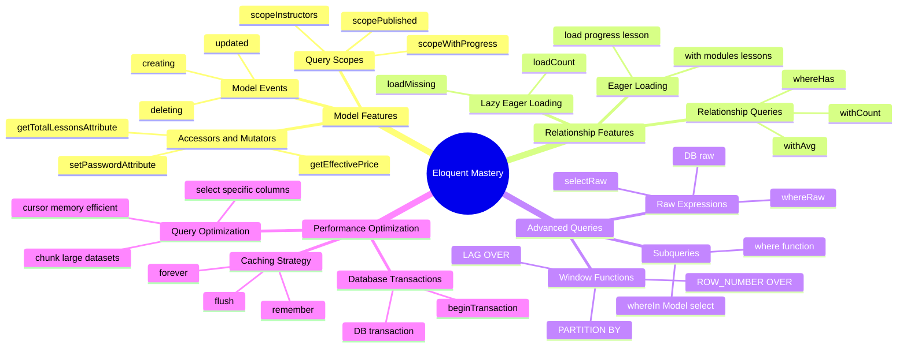
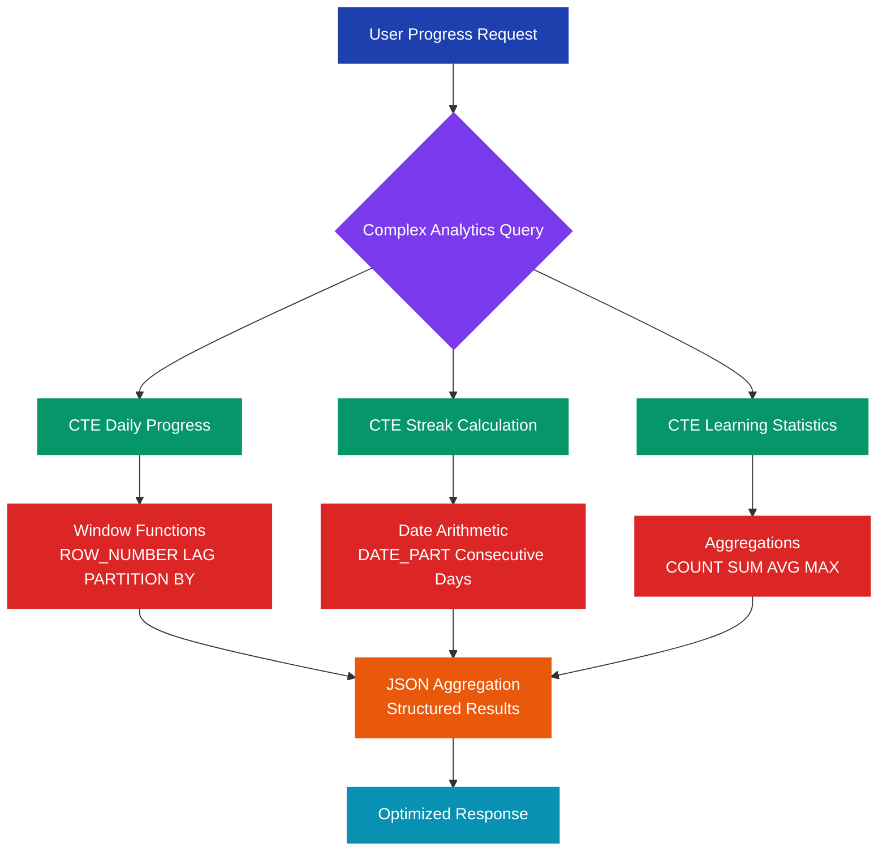

# 🎓 Laravel Learning Management System (LMS)

<p align="center">

</p>

<p align="center">
<strong>A comprehensive Learning Management System showcasing advanced Laravel concepts, design patterns, and modern architecture</strong>
</p>

<p align="center">


</p>

---

## 📖 Table of Contents

- [🎯 Project Overview](#-project-overview)
- [🏗️ Architecture & Design Patterns](#️-architecture--design-patterns)
- [💡 Laravel Concepts Demonstrated](#-laravel-concepts-demonstrated)
- [🗄️ Database Design](#️-database-design)
- [🔧 Core Features](#-core-features)
- [🚀 Advanced Implementations](#-advanced-implementations)
- [📊 Performance & Analytics](#-performance--analytics)
- [🛡️ Security Implementation](#️-security-implementation)
- [🧪 Testing Strategy](#-testing-strategy)
- [📦 Installation & Setup](#-installation--setup)
- [🎯 API Documentation](#-api-documentation)

---

## 🎯 Project Overview

This Learning Management System is a **production-ready Laravel application** that demonstrates comprehensive implementation of modern Laravel concepts, design patterns, and best practices. Built as a showcase of advanced Laravel development skills, it implements a complete educational platform with sophisticated user management, course delivery, progress tracking, and assessment systems.

### 🌟 Key Highlights

- **12 Eloquent Models** with complex relationships
- **17 Database Migrations** with advanced PostgreSQL features
- **RESTful API Architecture** with role-based access control
- **Advanced Progress Tracking** using Window Functions & CTEs
- **Automated Quiz System** with intelligent grading
- **Asynchronous Job Processing** for email notifications
- **Comprehensive Security** implementation

---

## 🏗️ Architecture & Design Patterns

### 🏛️ **Architectural Patterns Implemented**

```mermaid
graph TD
    subgraph SLP ["🔧 Service Layer Pattern"]
        SL1[QuizGradingService] --> SL2[Complex Business Logic]
        SL2 --> SL3[Auto-grading Algorithm]
        SL2 --> SL4[Multiple Question Types]
        SL2 --> SL5[Intelligent Feedback]
        
        SL6[EmailService] --> SL7[Queue Job Integration]
        SL7 --> SL8[Asynchronous Processing]
        SL7 --> SL9[Error Handling]
    end
    
    subgraph RPP ["📚 Repository Pattern Smart Models"]
        RP1[Course Model] --> RP2[Business Methods]
        RP2 --> RP3[getEffectivePrice]
        RP2 --> RP4[getProgressForUser]
        RP2 --> RP5[getCompletionStatistics]
        
        RP6[Progress Model] --> RP7[Analytics Methods]
        RP7 --> RP8[getUserProgressAnalytics]
        RP7 --> RP9[getLearningStreak]
        RP7 --> RP10[getCourseProgress]
    end
    
    subgraph OPP ["⚡ Observer Pattern Events"]
        OP1[Model Events] --> OP2[Enrollment Created]
        OP2 --> OP3[Send Welcome Email]
        OP2 --> OP4[Update Analytics]
        
        OP5[Progress Updated] --> OP6[Check Course Completion]
        OP6 --> OP7[Award Certificate]
    end
    
    subgraph SPP ["🎯 Strategy Pattern"]
        SP1[QuizGradingStrategy] --> SP2[Multiple Choice Strategy]
        SP1 --> SP3[True False Strategy]
        SP1 --> SP4[Short Answer Strategy]
        
        SP5[PaymentStrategy] --> SP6[Credit Card Gateway]
        SP5 --> SP7[PayPal Gateway]
        SP5 --> SP8[Bank Transfer]
    end
    
    style SL1 fill:#0f172a,stroke:#1e293b,stroke-width:3px,color:#ffffff
    style SL2 fill:#1e293b,stroke:#334155,stroke-width:2px,color:#ffffff
    style SL3 fill:#1e293b,stroke:#334155,stroke-width:2px,color:#ffffff
    style SL4 fill:#1e293b,stroke:#334155,stroke-width:2px,color:#ffffff
    style SL5 fill:#1e293b,stroke:#334155,stroke-width:2px,color:#ffffff
    style SL6 fill:#0f172a,stroke:#1e293b,stroke-width:3px,color:#ffffff
    style SL7 fill:#1e293b,stroke:#334155,stroke-width:2px,color:#ffffff
    style SL8 fill:#1e293b,stroke:#334155,stroke-width:2px,color:#ffffff
    style SL9 fill:#1e293b,stroke:#334155,stroke-width:2px,color:#ffffff
    
    style RP1 fill:#581c87,stroke:#7c2d12,stroke-width:3px,color:#ffffff
    style RP2 fill:#7c2d12,stroke:#a3470a,stroke-width:2px,color:#ffffff
    style RP3 fill:#7c2d12,stroke:#a3470a,stroke-width:2px,color:#ffffff
    style RP4 fill:#7c2d12,stroke:#a3470a,stroke-width:2px,color:#ffffff
    style RP5 fill:#7c2d12,stroke:#a3470a,stroke-width:2px,color:#ffffff
    style RP6 fill:#581c87,stroke:#7c2d12,stroke-width:3px,color:#ffffff
    style RP7 fill:#7c2d12,stroke:#a3470a,stroke-width:2px,color:#ffffff
    style RP8 fill:#7c2d12,stroke:#a3470a,stroke-width:2px,color:#ffffff
    style RP9 fill:#7c2d12,stroke:#a3470a,stroke-width:2px,color:#ffffff
    style RP10 fill:#7c2d12,stroke:#a3470a,stroke-width:2px,color:#ffffff
    
    style OP1 fill:#064e3b,stroke:#065f46,stroke-width:3px,color:#ffffff
    style OP2 fill:#065f46,stroke:#047857,stroke-width:2px,color:#ffffff
    style OP3 fill:#065f46,stroke:#047857,stroke-width:2px,color:#ffffff
    style OP4 fill:#065f46,stroke:#047857,stroke-width:2px,color:#ffffff
    style OP5 fill:#064e3b,stroke:#065f46,stroke-width:3px,color:#ffffff
    style OP6 fill:#065f46,stroke:#047857,stroke-width:2px,color:#ffffff
    style OP7 fill:#065f46,stroke:#047857,stroke-width:2px,color:#ffffff
    
    style SP1 fill:#7f1d1d,stroke:#991b1b,stroke-width:3px,color:#ffffff
    style SP2 fill:#991b1b,stroke:#b91c1c,stroke-width:2px,color:#ffffff
    style SP3 fill:#991b1b,stroke:#b91c1c,stroke-width:2px,color:#ffffff
    style SP4 fill:#991b1b,stroke:#b91c1c,stroke-width:2px,color:#ffffff
    style SP5 fill:#7f1d1d,stroke:#991b1b,stroke-width:3px,color:#ffffff
    style SP6 fill:#991b1b,stroke:#b91c1c,stroke-width:2px,color:#ffffff
    style SP7 fill:#991b1b,stroke:#b91c1c,stroke-width:2px,color:#ffffff
    style SP8 fill:#991b1b,stroke:#b91c1c,stroke-width:2px,color:#ffffff
```



**Design Pattern Implementation Examples:**

```php
// Service Layer Pattern - QuizGradingService
class QuizGradingService 
{
    public function gradeAttempt(QuizAttempt $attempt): array
    {
        $results = [];
        $totalPoints = 0;
        $earnedPoints = 0;

        foreach ($attempt->quizAnswers as $answer) {
            $strategy = $this->getGradingStrategy($answer->quizQuestion->type);
            $result = $strategy->grade($answer);
            
            $results[] = $result;
            $totalPoints += $result['points_possible'];
            $earnedPoints += $result['points_earned'];
        }

        return $this->calculateFinalScore($totalPoints, $earnedPoints, $attempt);
    }

    private function getGradingStrategy(string $questionType): GradingStrategyInterface
    {
        return match($questionType) {
            'multiple_choice' => new MultipleChoiceStrategy(),
            'true_false' => new TrueFalseStrategy(),
            'short_answer' => new ShortAnswerStrategy(),
            default => throw new InvalidArgumentException("Unknown question type: {$questionType}")
        };
    }
}

// Repository Pattern - Smart Models with Business Logic
class Course extends Model 
{
    // Business logic encapsulated in model
    public function getEffectivePrice(): float
    {
        return $this->discount_price ?: $this->price;
    }

    public function getProgressForUser(int $userId): float
    {
        $totalLessons = $this->lessons()->count();
        
        if ($totalLessons === 0) {
            return 0;
        }

        $completedLessons = $this->lessons()
            ->whereHas('progress', function ($query) use ($userId) {
                $query->where('user_id', $userId)
                      ->whereNotNull('completed_at');
            })
            ->count();

        return round(($completedLessons / $totalLessons) * 100, 2);
    }

    public function getCompletionStatistics(): array
    {
        return [
            'total_students' => $this->enrollments()->count(),
            'completed_students' => $this->enrollments()
                ->where('status', 'completed')->count(),
            'average_progress' => $this->enrollments()
                ->avg('progress_percentage'),
            'total_revenue' => $this->transactions()
                ->where('status', 'completed')->sum('amount'),
            'satisfaction_rating' => $this->reviews()->avg('rating')
        ];
    }
}

// Observer Pattern - Model Events
class EnrollmentObserver
{
    public function created(Enrollment $enrollment): void
    {
        // Dispatch welcome email job
        SendEnrollmentConfirmationEmail::dispatch($enrollment);
        
        // Update course analytics
        $this->updateCourseAnalytics($enrollment->course);
        
        // Initialize progress tracking
        $this->initializeProgressTracking($enrollment);
    }

    public function updated(Enrollment $enrollment): void
    {
        if ($enrollment->wasChanged('status') && $enrollment->status === 'completed') {
            // Award completion certificate
            GenerateCompletionCertificate::dispatch($enrollment);
            
            // Send congratulations email
            SendCourseCompletionEmail::dispatch($enrollment);
        }
    }
}

// Strategy Pattern - Grading Strategies
interface GradingStrategyInterface
{
    public function grade(QuizAnswer $answer): array;
}

class MultipleChoiceStrategy implements GradingStrategyInterface
{
    public function grade(QuizAnswer $answer): array
    {
        $question = $answer->quizQuestion;
        $userAnswers = $answer->answer;
        $correctAnswers = $question->correct_answers;

        sort($userAnswers);
        sort($correctAnswers);

        $isCorrect = $userAnswers === $correctAnswers;
        $pointsEarned = $isCorrect ? $question->points : 0;

        return [
            'is_correct' => $isCorrect,
            'points_earned' => $pointsEarned,
            'points_possible' => $question->points,
            'feedback' => $this->generateFeedback($question, $isCorrect)
        ];
    }
}
```

#### 1. **Service Layer Pattern**
```php
// QuizGradingService - Complex business logic separation
class QuizGradingService 
{
    public function gradeAttempt(QuizAttempt $attempt): array
    {
        // Sophisticated auto-grading logic
        // Multiple question types support
        // Intelligent feedback generation
    }
}
```

#### 2. **Job Queue Pattern** 
```php
// Asynchronous email processing
class SendEnrollmentConfirmationEmail implements ShouldQueue
{
    use Queueable;
    
    public function handle(): void
    {
        Mail::to($this->enrollment->user->email)
            ->send(new EnrollmentConfirmationMail($this->enrollment));
    }
}
```

#### 3. **Middleware Pattern**
```php
// Custom role-based authorization
class RoleMiddleware
{
    public function handle(Request $request, Closure $next, ...$roles)
    {
        $userRole = $request->user()->role;
        
        if (!in_array($userRole, $roles)) {
            return response()->json(['message' => 'Forbidden'], 403);
        }
        
        return $next($request);
    }
}
```

#### 4. **Repository Pattern (Eloquent Models as Smart Repositories)**
```php
// Models with business logic encapsulation
class Course extends Model 
{
    public function getEffectivePrice()
    {
        return $this->discount_price ?: $this->price;
    }
    
    public function getProgressForUser($userId)
    {
        // Complex progress calculation logic
    }
}
```

---

## 💡 Laravel Concepts Demonstrated

### 🎯 **Laravel Eloquent Relationship Mastery**

```mermaid
graph TB
    subgraph HMR ["📊 HasMany Relationships"]
        U1[👤 User] -->|HasMany| C1[📚 Courses as Instructor]
        U1 -->|HasMany| E1[📝 Enrollments]
        U1 -->|HasMany| P1[📈 Progress Records]
        U1 -->|HasMany| QA1[📋 Quiz Attempts]
        U1 -->|HasMany| T1[💳 Transactions]
        
        C2[📚 Course] -->|HasMany| M1[📖 Modules]
        C2 -->|HasMany| E2[📝 Enrollments]
        C2 -->|HasMany| T2[💳 Transactions]
        
        M2[📖 Module] -->|HasMany| L1[📄 Lessons]
        L2[📄 Lesson] -->|HasMany| P2[📈 Progress]
        L2 -->|HasMany| Q1[❓ Quizzes]
        
        Q2[❓ Quiz] -->|HasMany| QQ1[❔ Quiz Questions]
        Q2 -->|HasMany| QA2[📋 Quiz Attempts]
    end
    
    subgraph BTR ["🔗 BelongsTo Relationships"]
        C3[📚 Course] -->|BelongsTo| U2[👨‍🏫 Instructor User]
        C3 -->|BelongsTo| CAT1[🏷️ Category]
        
        M3[📖 Module] -->|BelongsTo| C4[📚 Course]
        L3[📄 Lesson] -->|BelongsTo| M4[📖 Module]
        
        E3[📝 Enrollment] -->|BelongsTo| U3[👤 User]
        E3 -->|BelongsTo| C5[📚 Course]
        
        P3[📈 Progress] -->|BelongsTo| U4[👤 User]
        P3 -->|BelongsTo| L4[📄 Lesson]
    end
    
    subgraph AR ["⚡ Advanced Relationships"]
        C6[📚 Course] -.->|HasManyThrough| L5[📄 Lessons via Modules]
        C6 -.->|BelongsToMany with Pivot| U5[👥 Students via Enrollments]
        L6[📄 Lesson] -.->|HasOneThrough| C7[📚 Course via Module]
    end
    
    style U1 fill:#0f172a,stroke:#1e293b,stroke-width:3px,color:#ffffff
    style C1 fill:#1e293b,stroke:#334155,stroke-width:2px,color:#ffffff
    style E1 fill:#1e293b,stroke:#334155,stroke-width:2px,color:#ffffff
    style P1 fill:#1e293b,stroke:#334155,stroke-width:2px,color:#ffffff
    style QA1 fill:#1e293b,stroke:#334155,stroke-width:2px,color:#ffffff
    style T1 fill:#1e293b,stroke:#334155,stroke-width:2px,color:#ffffff
    
    style C2 fill:#581c87,stroke:#7c2d12,stroke-width:3px,color:#ffffff
    style M1 fill:#7c2d12,stroke:#a3470a,stroke-width:2px,color:#ffffff
    style E2 fill:#7c2d12,stroke:#a3470a,stroke-width:2px,color:#ffffff
    style T2 fill:#7c2d12,stroke:#a3470a,stroke-width:2px,color:#ffffff
    
    style M2 fill:#064e3b,stroke:#065f46,stroke-width:3px,color:#ffffff
    style L1 fill:#065f46,stroke:#047857,stroke-width:2px,color:#ffffff
    style L2 fill:#064e3b,stroke:#065f46,stroke-width:3px,color:#ffffff
    style P2 fill:#065f46,stroke:#047857,stroke-width:2px,color:#ffffff
    style Q1 fill:#065f46,stroke:#047857,stroke-width:2px,color:#ffffff
    
    style Q2 fill:#7f1d1d,stroke:#991b1b,stroke-width:3px,color:#ffffff
    style QQ1 fill:#991b1b,stroke:#b91c1c,stroke-width:2px,color:#ffffff
    style QA2 fill:#991b1b,stroke:#b91c1c,stroke-width:2px,color:#ffffff
    
    style U2 fill:#1e293b,stroke:#334155,stroke-width:2px,color:#ffffff
    style C3 fill:#7c2d12,stroke:#a3470a,stroke-width:2px,color:#ffffff
    style CAT1 fill:#7c2d12,stroke:#a3470a,stroke-width:2px,color:#ffffff
    style M3 fill:#065f46,stroke:#047857,stroke-width:2px,color:#ffffff
    style L3 fill:#065f46,stroke:#047857,stroke-width:2px,color:#ffffff
    style C4 fill:#7c2d12,stroke:#a3470a,stroke-width:2px,color:#ffffff
    style M4 fill:#065f46,stroke:#047857,stroke-width:2px,color:#ffffff
    style E3 fill:#1e293b,stroke:#334155,stroke-width:2px,color:#ffffff
    style U3 fill:#1e293b,stroke:#334155,stroke-width:2px,color:#ffffff
    style C5 fill:#7c2d12,stroke:#a3470a,stroke-width:2px,color:#ffffff
    style P3 fill:#065f46,stroke:#047857,stroke-width:2px,color:#ffffff
    style U4 fill:#1e293b,stroke:#334155,stroke-width:2px,color:#ffffff
    style L4 fill:#065f46,stroke:#047857,stroke-width:2px,color:#ffffff
    
    style C6 fill:#155e75,stroke:#0891b2,stroke-width:3px,color:#ffffff
    style L5 fill:#0891b2,stroke:#06b6d4,stroke-width:2px,color:#ffffff
    style U5 fill:#0891b2,stroke:#06b6d4,stroke-width:2px,color:#ffffff
    style L6 fill:#155e75,stroke:#0891b2,stroke-width:3px,color:#ffffff
    style C7 fill:#0891b2,stroke:#06b6d4,stroke-width:2px,color:#ffffff
```



**Eloquent Relationship Examples:**
```php
// HasManyThrough - Direct access to nested relationships
class Course extends Model 
{
    public function lessons()
    {
        return $this->hasManyThrough(
            Lesson::class,    // Final model
            Module::class,    // Intermediate model
            'course_id',      // Foreign key on modules table
            'module_id',      // Foreign key on lessons table
            'id',             // Local key on courses table
            'id'              // Local key on modules table
        );
    }
}

// BelongsToMany with Pivot Data
class Course extends Model 
{
    public function students()
    {
        return $this->belongsToMany(User::class, 'enrollments')
            ->withPivot([
                'enrolled_at', 
                'completed_at', 
                'progress_percentage',
                'payment_status'
            ])
            ->withTimestamps()
            ->wherePivot('status', 'active');
    }
}

// HasOneThrough - Access parent through intermediate
class Lesson extends Model 
{
    public function course()
    {
        return $this->hasOneThrough(
            Course::class,
            Module::class,
            'id',           // Foreign key on modules table
            'id',           // Foreign key on courses table  
            'module_id',    // Local key on lessons table
            'course_id'     // Local key on modules table
        );
    }
}
```

### **Advanced Eloquent Features Showcase**



### ✅ **Core Framework Features**

| **Concept** | **Implementation** | **Files** | **Code Examples** |
|-------------|-------------------|-----------|-------------------|
| **Eloquent ORM** | ⭐⭐⭐⭐⭐ Advanced | 12 Models | HasManyThrough, BelongsToMany, Pivot tables |
| **Migrations** | ⭐⭐⭐⭐⭐ Complete | 17 migrations | Foreign keys, indexes, JSON fields, constraints |
| **Seeders** | ⭐⭐⭐⭐⭐ Comprehensive | Multiple seeders | Realistic relational data, factories integration |
| **Validation** | ⭐⭐⭐⭐⭐ Extensive | All controllers | Custom rules, conditional validation, arrays |
| **Middleware** | ⭐⭐⭐⭐ Custom | RoleMiddleware | Multi-parameter, role-based authorization |
| **Route Groups** | ⭐⭐⭐⭐⭐ Organized | api.php | Nested groups, middleware application |
| **Query Scopes** | ⭐⭐⭐⭐ Advanced | Models | Dynamic, parameterized, chainable scopes |
| **API Resources** | ⚠️ Planned | - | Response formatting enhancement planned |

### 🔐 **Authentication & Authorization**

```php
// Laravel Sanctum Implementation
Route::middleware(['auth:sanctum', 'role:admin,instructor'])->group(function () {
    Route::prefix('instructor')->group(function () {
        Route::get('/analytics', [AnalyticsController::class, 'instructor']);
        Route::post('/courses', [CourseController::class, 'store']);
    });
});

// Email Verification System
Route::middleware(['auth:sanctum', 'verified'])->group(function () {
    // Protected routes requiring email verification
});
```

### 🗄️ **Advanced Database Features**

#### Complex Eloquent Relationships
```php
// Polymorphic & Through Relationships
class Course extends Model 
{
    // HasManyThrough relationship
    public function lessons()
    {
        return $this->hasManyThrough(Lesson::class, Module::class);
    }
    
    // BelongsToMany with pivot data
    public function students()
    {
        return $this->belongsToMany(User::class, 'enrollments')
            ->withPivot('enrolled_at', 'progress_percentage');
    }
}

// Advanced query scopes
class User extends Model 
{
    public function scopeInstructors($query)
    {
        return $query->where('role', 'instructor');
    }
    
    public function scopeWithCourseProgress($query, $courseId)
    {
        return $query->with(['progress' => function ($q) use ($courseId) {
            $q->whereHas('lesson.module', function ($q) use ($courseId) {
                $q->where('course_id', $courseId);
            });
        }]);
    }
}
```

#### PostgreSQL Advanced Features



**Advanced PostgreSQL Query Example:**
```sql
-- Real Production Query from Progress.php
WITH daily_progress AS (
    SELECT 
        user_id,
        DATE(completed_at) as study_date,
        COUNT(*) as lessons_completed,
        SUM(time_spent) as total_time,
        ROW_NUMBER() OVER (PARTITION BY user_id ORDER BY DATE(completed_at)) as day_number
    FROM progress 
    WHERE completed_at IS NOT NULL
    GROUP BY user_id, DATE(completed_at)
),
streak_calculation AS (
    SELECT 
        user_id,
        study_date,
        lessons_completed,
        LAG(study_date) OVER (PARTITION BY user_id ORDER BY study_date) as prev_date,
        CASE 
            WHEN DATE_PART('day', study_date - LAG(study_date) 
                 OVER (PARTITION BY user_id ORDER BY study_date)) = 1 
            THEN 1 ELSE 0 
        END as is_consecutive
    FROM daily_progress
),
course_progress AS (
    SELECT 
        p.user_id,
        c.id as course_id,
        c.title,
        COUNT(p.lesson_id) as completed_lessons,
        COUNT(l.id) as total_lessons,
        ROUND(
            (COUNT(p.lesson_id)::decimal / COUNT(l.id)) * 100, 2
        ) as completion_percentage,
        JSON_AGG(
            JSON_BUILD_OBJECT(
                'lesson_id', l.id,
                'lesson_title', l.title,
                'completed_at', p.completed_at,
                'time_spent', p.time_spent
            ) ORDER BY l.order
        ) as lesson_progress
    FROM courses c
    JOIN modules m ON m.course_id = c.id
    JOIN lessons l ON l.module_id = m.id
    LEFT JOIN progress p ON p.lesson_id = l.id
    GROUP BY p.user_id, c.id, c.title
)
SELECT 
    dp.user_id,
    COUNT(DISTINCT dp.study_date) as total_study_days,
    SUM(dp.lessons_completed) as total_lessons_completed,
    ROUND(AVG(dp.lessons_completed), 2) as avg_lessons_per_day,
    MAX(dp.lessons_completed) as best_day_performance,
    COUNT(CASE WHEN sc.is_consecutive = 1 THEN 1 END) as streak_days,
    JSON_AGG(
        JSON_BUILD_OBJECT(
            'date', dp.study_date,
            'lessons', dp.lessons_completed,
            'time_spent', dp.total_time
        ) ORDER BY dp.study_date DESC
    ) as recent_activity,
    (
        SELECT JSON_AGG(cp.*)
        FROM course_progress cp
        WHERE cp.user_id = dp.user_id
    ) as course_breakdown
FROM daily_progress dp
LEFT JOIN streak_calculation sc ON dp.user_id = sc.user_id 
    AND dp.study_date = sc.study_date
WHERE dp.user_id = ?
GROUP BY dp.user_id;
```

### 🔍 **Database Performance Optimizations**

```mermaid
graph TD
    A[🎯 Database Optimization Strategy] --> B[🗂️ Indexing Strategy]
    A --> C[⚡ Query Optimization]
    A --> D[🔗 Relationship Efficiency]
    
    B --> B1[🔑 Primary Keys BIGINT AUTO_INCREMENT]
    B --> B2[🔗 Foreign Keys Cascading Constraints]
    B --> B3[🔒 Unique Constraints user_id plus lesson_id]
    B --> B4[📊 Composite Indexes user_id plus completed_at]
    B --> B5[📋 JSON Indexes GIN indexes for JSON fields]
    
    C --> C1[🪟 Window Functions Avoid N plus 1 queries]
    C --> C2[🔄 CTEs Complex logic simplification]
    C --> C3[⚡ Eager Loading with relationships]
    C --> C4[🎯 Query Scopes Reusable query logic]
    
    D --> D1[🔄 HasManyThrough Direct lesson access]
    D --> D2[🔗 BelongsToMany Pivot table optimization]
    D --> D3[🔀 Polymorphic Flexible relationships]
    D --> D4[💤 Lazy Loading On demand data]
    
    style A fill:#0f172a,stroke:#1e293b,stroke-width:4px,color:#ffffff
    style B fill:#7f1d1d,stroke:#991b1b,stroke-width:3px,color:#ffffff
    style C fill:#064e3b,stroke:#065f46,stroke-width:3px,color:#ffffff
    style D fill:#581c87,stroke:#7c2d12,stroke-width:3px,color:#ffffff
    
    style B1 fill:#991b1b,stroke:#b91c1c,stroke-width:2px,color:#ffffff
    style B2 fill:#991b1b,stroke:#b91c1c,stroke-width:2px,color:#ffffff
    style B3 fill:#991b1b,stroke:#b91c1c,stroke-width:2px,color:#ffffff
    style B4 fill:#991b1b,stroke:#b91c1c,stroke-width:2px,color:#ffffff
    style B5 fill:#991b1b,stroke:#b91c1c,stroke-width:2px,color:#ffffff
    
    style C1 fill:#065f46,stroke:#047857,stroke-width:2px,color:#ffffff
    style C2 fill:#065f46,stroke:#047857,stroke-width:2px,color:#ffffff
    style C3 fill:#065f46,stroke:#047857,stroke-width:2px,color:#ffffff
    style C4 fill:#065f46,stroke:#047857,stroke-width:2px,color:#ffffff
    
    style D1 fill:#7c2d12,stroke:#a3470a,stroke-width:2px,color:#ffffff
    style D2 fill:#7c2d12,stroke:#a3470a,stroke-width:2px,color:#ffffff
    style D3 fill:#7c2d12,stroke:#a3470a,stroke-width:2px,color:#ffffff
    style D4 fill:#7c2d12,stroke:#a3470a,stroke-width:2px,color:#ffffff
```



**Index Strategy Examples:**
```sql
-- Performance-critical indexes implemented
CREATE INDEX idx_progress_user_completed ON progress(user_id, completed_at);
CREATE INDEX idx_enrollments_user_course ON enrollments(user_id, course_id);
CREATE INDEX idx_quiz_attempts_user_quiz ON quiz_attempts(user_id, quiz_id);
CREATE UNIQUE INDEX idx_progress_user_lesson ON progress(user_id, lesson_id);

-- JSON field optimization for PostgreSQL
CREATE INDEX idx_courses_requirements ON courses USING GIN(requirements);
CREATE INDEX idx_quiz_questions_options ON quiz_questions USING GIN(options);
```

---

## 🗄️ Database Design

### 📊 **Complete Entity Relationship Diagram**

```mermaid
erDiagram
    %% Core User Management
    Users {
        bigint id PK
        string name
        string email UK
        enum role "admin,instructor,student"
        timestamp email_verified_at
        string password
        text bio
        string avatar
        timestamps created_at_updated_at
    }

    %% Course Structure
    Categories {
        bigint id PK
        string name
        string slug UK
        text description
        boolean is_active
        timestamps created_at_updated_at
    }

    Courses {
        bigint id PK
        string title
        string slug UK
        text description
        text short_description
        string thumbnail
        decimal price "10,2"
        decimal discount_price "10,2"
        integer duration_hours
        enum level "beginner,intermediate,advanced"
        string language
        boolean is_published
        boolean is_featured
        bigint category_id FK
        bigint instructor_id FK
        integer max_students
        json requirements
        json what_you_learn
        timestamps created_at_updated_at
    }

    Modules {
        bigint id PK
        string title
        text description
        integer order
        bigint course_id FK
        boolean is_published
        timestamps created_at_updated_at
    }

    Lessons {
        bigint id PK
        bigint module_id FK
        string title
        text content
        string video_url
        integer duration_minutes
        integer order
        boolean is_published
        timestamps created_at_updated_at
    }

    %% Progress Tracking System
    Enrollments {
        bigint id PK
        bigint user_id FK
        bigint course_id FK
        enum status "active,completed,cancelled,expired"
        decimal amount_paid "10,2"
        enum payment_status "pending,paid,refunded"
        integer progress_percentage
        timestamp enrolled_at
        timestamp completed_at
        timestamp expires_at
        timestamps created_at_updated_at
    }

    Progress {
        bigint id PK
        bigint user_id FK
        bigint lesson_id FK
        timestamp completed_at
        integer time_spent "in_seconds"
        timestamps created_at_updated_at
        unique user_lesson_unique "user_id,lesson_id"
        index user_completed_idx "user_id,completed_at"
    }

    %% Assessment System
    Quizzes {
        bigint id PK
        string title
        text description
        text instructions
        bigint lesson_id FK
        integer time_limit_minutes
        integer max_attempts
        decimal passing_score "5,2"
        boolean shuffle_questions
        boolean show_results_immediately
        boolean allow_review
        boolean is_published
        timestamp available_from
        timestamp available_until
        timestamps created_at_updated_at
    }

    QuizQuestions {
        bigint id PK
        bigint quiz_id FK
        enum type "multiple_choice,true_false,short_answer"
        text question
        json options
        json correct_answers
        text explanation
        decimal points "8,2"
        integer order_position
        boolean case_sensitive
        timestamps created_at_updated_at
    }

    QuizAttempts {
        bigint id PK
        bigint quiz_id FK
        bigint user_id FK
        integer attempt_number
        timestamp started_at
        timestamp completed_at
        decimal score "5,2"
        decimal total_points "8,2"
        decimal earned_points "8,2"
        boolean is_passed
        json answers
        integer time_spent_seconds
        enum status "in_progress,completed,abandoned"
        timestamps created_at_updated_at
    }

    QuizAnswers {
        bigint id PK
        bigint quiz_attempt_id FK
        bigint quiz_question_id FK
        json answer
        boolean is_correct
        decimal points_earned "8,2"
        decimal points_possible "8,2"
        text feedback
        timestamps created_at_updated_at
    }

    %% Payment System
    Transactions {
        bigint id PK
        bigint user_id FK
        bigint course_id FK
        bigint enrollment_id FK
        string transaction_id UK
        enum payment_method "credit_card,paypal,bank_transfer"
        decimal amount "10,2"
        string currency "3_chars"
        enum status "pending,processing,completed,failed,cancelled,refunded"
        string payment_gateway
        string gateway_transaction_id
        json gateway_response
        timestamp processed_at
        timestamp failed_at
        text failure_reason
        timestamps created_at_updated_at
    }

    %% Laravel Framework Tables
    PersonalAccessTokens {
        bigint id PK
        string tokenable_type
        bigint tokenable_id
        string name
        string token UK
        json abilities
        timestamp last_used_at
        timestamp expires_at
        timestamps created_at_updated_at
        index tokenable "tokenable_type,tokenable_id"
    }

    %% Relationships with High Contrast Colors
    Users ||--o{ Courses : "👨‍🏫 instructs (instructor_id)"
    Users ||--o{ Enrollments : "📚 enrolls_in"
    Users ||--o{ Progress : "📈 tracks_progress"
    Users ||--o{ QuizAttempts : "📝 takes_quiz"
    Users ||--o{ Transactions : "💳 makes_payment"
    Users ||--o{ PersonalAccessTokens : "🔐 has_tokens"

    Categories ||--o{ Courses : "🏷️ categorizes"
    
    Courses ||--o{ Modules : "📖 contains"
    Courses ||--o{ Enrollments : "👥 enrolled_by_students"
    Courses ||--o{ Transactions : "💰 generates_revenue"
    
    Modules ||--o{ Lessons : "📄 has_lessons"
    
    Lessons ||--o{ Progress : "📊 progress_tracked"
    Lessons ||--o{ Quizzes : "❓ has_assessments"
    
    Quizzes ||--o{ QuizQuestions : "❔ contains_questions"
    Quizzes ||--o{ QuizAttempts : "📋 attempted_by_students"
    
    QuizAttempts ||--o{ QuizAnswers : "✅ has_answers"
    
    QuizQuestions ||--o{ QuizAnswers : "🔗 answered_in_attempt"
    
    Enrollments ||--o{ Transactions : "💵 payment_processed"
    Enrollments ||--o{ Progress : "📈 tracks_course_progress"
```



### 🏗️ **12 Eloquent Models Architecture**

```mermaid
classDiagram
    direction TB
    
    class User {
        +string name
        +string email
        +enum role
        +coursesAsInstructor()
        +enrollments()
        +progress()
        +quizAttempts()
        +transactions()
        +scopeInstructors()
        +scopeWithCourseProgress()
    }

    class Category {
        +string name
        +string slug
        +courses()
        +activeCourses()
    }

    class Course {
        +string title
        +decimal price
        +decimal discount_price
        +instructor()
        +category()
        +modules()
        +lessons()
        +enrollments()
        +students()
        +transactions()
        +getEffectivePrice()
        +getProgressForUser()
        +getCompletionStatistics()
        +isFree()
    }

    class Module {
        +string title
        +integer order
        +course()
        +lessons()
        +getTotalDurationAttribute()
    }

    class Lesson {
        +string title
        +text content
        +integer duration_minutes
        +module()
        +course()
        +progress()
        +quizzes()
        +isCompletedBy()
        +getCompletionRate()
    }

    class Enrollment {
        +enum status
        +decimal amount_paid
        +integer progress_percentage
        +user()
        +course()
        +transactions()
        +progress()
        +isActive()
        +isCompleted()
        +isPaid()
    }

    class Progress {
        +timestamp completed_at
        +integer time_spent
        +user()
        +lesson()
        +markAsCompleted()
        +isCompleted()
        +getUserProgressAnalytics()
        +getLearningStreak()
        +getCourseProgress()
    }

    class Quiz {
        +string title
        +integer time_limit_minutes
        +decimal passing_score
        +lesson()
        +questions()
        +attempts()
        +canUserTake()
        +getAverageScore()
    }

    class QuizQuestion {
        +enum type
        +text question
        +json options
        +json correct_answers
        +decimal points
        +quiz()
        +answers()
        +checkAnswer()
    }

    class QuizAttempt {
        +integer attempt_number
        +decimal score
        +boolean is_passed
        +json answers
        +quiz()
        +user()
        +quizAnswers()
        +calculateScore()
        +isCompleted()
    }

    class QuizAnswer {
        +json answer
        +boolean is_correct
        +decimal points_earned
        +quizAttempt()
        +quizQuestion()
        +grade()
    }

    class Transaction {
        +string transaction_id
        +decimal amount
        +enum status
        +json gateway_response
        +user()
        +course()
        +enrollment()
        +isSuccessful()
        +isPending()
        +hasFailed()
        +markAsCompleted()
    }

    User ||--o{ Course : instructs
    User ||--o{ Enrollment : enrolls
    User ||--o{ Progress : tracks
    User ||--o{ QuizAttempt : attempts
    User ||--o{ Transaction : pays

    Category ||--o{ Course : categorizes
    Course ||--o{ Module : contains
    Module ||--o{ Lesson : has
    Course ||--o{ Enrollment : enrolled
    Course ||--o{ Transaction : generates

    Lesson ||--o{ Progress : tracked
    Lesson ||--o{ Quiz : assessed

    Quiz ||--o{ QuizQuestion : contains
    Quiz ||--o{ QuizAttempt : attempted
    QuizAttempt ||--o{ QuizAnswer : answered
    QuizQuestion ||--o{ QuizAnswer : relates

    Enrollment ||--o{ Transaction : processed
    Enrollment ||--o{ Progress : course_progress
```

### 🗄️ **17 Database Migrations Timeline**

```mermaid
gitgraph
    commit id: "Users_Table"
    commit id: "Categories"
    commit id: "Courses"
    commit id: "Modules"
    commit id: "Lessons"
    commit id: "Enrollments"
    commit id: "Progress"
    commit id: "Reviews"
    commit id: "Payments"
    commit id: "Sanctum_Tokens"
    commit id: "Transactions"
    commit id: "Quizzes"
    commit id: "Quiz_Questions"
    commit id: "Quiz_Attempts"
    commit id: "Quiz_Answers"
    commit id: "Personal_Access_Tokens"
    commit id: "Job_Batches"
```

**Migration Details:**

| **Order** | **Migration** | **Purpose** | **Key Features** |
|-----------|---------------|-------------|------------------|
| 1 | `create_users_table` | Multi-role authentication | Email verification, role-based access |
| 2 | `create_categories_table` | Course categorization | SEO-friendly slugs, active states |
| 3 | `create_courses_table` | Course management | Pricing, JSON fields, instructor relations |
| 4 | `create_modules_table` | Course structure | Hierarchical organization, ordering |
| 5 | `create_lessons_table` | Content delivery | Video integration, duration tracking |
| 6 | `create_enrollments_table` | Student registration | Payment status, progress tracking |
| 7 | `create_progress_table` | Learning analytics | Time tracking, completion status |
| 8 | `create_reviews_table` | Course feedback | Rating system, student reviews |
| 9 | `create_payments_table` | Payment processing | Transaction management |
| 10 | `create_personal_access_tokens_table` | API authentication | Laravel Sanctum integration |
| 11 | `create_transactions_table` | Advanced payments | Gateway integration, status tracking |
| 12 | `create_quizzes_table` | Assessment system | Time limits, attempt controls |
| 13 | `create_quiz_questions_table` | Question management | Multiple types, JSON storage |
| 14 | `create_quiz_attempts_table` | Attempt tracking | Scoring, timing, status |
| 15 | `create_quiz_answers_table` | Answer storage | Auto-grading, feedback |

### 🏗️ **Database Schema Highlights**

#### **Users Table** - Multi-role Authentication
```php
Schema::create('users', function (Blueprint $table) {
    $table->id();
    $table->string('name');
    $table->string('email')->unique();
    $table->enum('role', ['admin', 'instructor', 'student'])->default('student');
    $table->timestamp('email_verified_at')->nullable();
    $table->string('password');
    $table->rememberToken();
    $table->timestamps();
});
```

#### **Progress Table** - Advanced Tracking
```php
Schema::create('progress', function (Blueprint $table) {
    $table->id();
    $table->foreignId('user_id')->constrained()->onDelete('cascade');
    $table->foreignId('lesson_id')->constrained()->onDelete('cascade');
    $table->timestamp('completed_at')->nullable();
    $table->integer('time_spent')->default(0); // seconds
    $table->timestamps();
    
    $table->unique(['user_id', 'lesson_id']); // Prevent duplicates
    $table->index(['user_id', 'completed_at']); // Performance optimization
});
```

---

## 🔧 Core Features

### 👥 **User Management & Authentication**

```php
// Multi-role User System
class User extends Authenticatable
{
    protected $fillable = [
        'name', 'email', 'password', 'role', 'bio', 'avatar'
    ];
    
    // Role-based relationships
    public function coursesAsInstructor()
    {
        return $this->hasMany(Course::class, 'instructor_id');
    }
    
    public function enrollments()
    {
        return $this->hasMany(Enrollment::class);
    }
}

// API Authentication with Sanctum
Route::post('/login', function (Request $request) {
    $credentials = $request->validate([
        'email' => 'required|email',
        'password' => 'required'
    ]);
    
    if (Auth::attempt($credentials)) {
        $token = Auth::user()->createToken('api-token')->plainTextToken;
        return response()->json(['token' => $token]);
    }
    
    return response()->json(['message' => 'Invalid credentials'], 401);
});
```

### 📚 **Course Management System**

```php
class Course extends Model 
{
    // Dynamic pricing with discounts
    public function getEffectivePrice()
    {
        return $this->discount_price ?: $this->price;
    }
    
    // Course statistics
    public function getCompletionStatistics()
    {
        return [
            'total_students' => $this->enrollments()->count(),
            'completed_students' => $this->enrollments()
                ->where('status', 'completed')->count(),
            'average_progress' => $this->enrollments()
                ->avg('progress_percentage'),
            'total_revenue' => $this->transactions()
                ->where('status', 'completed')->sum('amount')
        ];
    }
}
```

### 📊 **Progress Tracking System**

```php
class Progress extends Model 
{
    // Advanced analytics with PostgreSQL
    public static function getUserProgressAnalytics($userId)
    {
        return DB::select("
            WITH daily_progress AS (
                SELECT 
                    DATE(completed_at) as study_date,
                    COUNT(*) as lessons_completed,
                    SUM(time_spent) as total_time
                FROM progress 
                WHERE user_id = ? AND completed_at IS NOT NULL
                GROUP BY DATE(completed_at)
            ),
            streak_calculation AS (
                SELECT 
                    study_date,
                    lessons_completed,
                    LAG(study_date) OVER (ORDER BY study_date) as prev_date,
                    CASE 
                        WHEN DATE_PART('day', study_date - LAG(study_date) OVER (ORDER BY study_date)) = 1 
                        THEN 1 ELSE 0 
                    END as is_consecutive
                FROM daily_progress
            )
            SELECT 
                COUNT(*) as total_study_days,
                SUM(lessons_completed) as total_lessons,
                ROUND(AVG(lessons_completed), 2) as avg_lessons_per_day,
                MAX(lessons_completed) as max_lessons_in_day
            FROM daily_progress
        ", [$userId]);
    }
}
```

---

## 🚀 Advanced Implementations

### 🧠 **Intelligent Quiz System**

```php
class QuizGradingService 
{
    public function gradeAttempt(QuizAttempt $attempt): array
    {
        $totalPoints = 0;
        $earnedPoints = 0;
        $results = [];

        foreach ($attempt->quizAnswers as $answer) {
            $questionResult = $this->gradeAnswer($answer);
            $results[] = $questionResult;
            
            $totalPoints += $questionResult['points_possible'];
            $earnedPoints += $questionResult['points_earned'];
        }

        $score = $totalPoints > 0 ? ($earnedPoints / $totalPoints) * 100 : 0;
        $isPassed = $score >= $attempt->quiz->passing_score;

        return [
            'score' => round($score, 2),
            'is_passed' => $isPassed,
            'detailed_results' => $results
        ];
    }

    private function checkAnswer(QuizQuestion $question, array $userAnswer): bool
    {
        switch ($question->type) {
            case 'multiple_choice':
                return $this->checkMultipleChoice($question, $userAnswer);
            case 'true_false':
                return $this->checkTrueFalse($question, $userAnswer);
            case 'short_answer':
                return $this->checkShortAnswer($question, $userAnswer);
            default:
                return false;
        }
    }
}
```

### 📧 **Asynchronous Email System**

```php
// Job for handling enrollment confirmations
class SendEnrollmentConfirmationEmail implements ShouldQueue
{
    use Queueable;
    
    public $enrollment;

    public function __construct(Enrollment $enrollment)
    {
        $this->enrollment = $enrollment;
    }

    public function handle(): void
    {
        $this->enrollment->load(['user', 'course.instructor']);

        Mail::to($this->enrollment->user->email)
            ->send(new EnrollmentConfirmationMail($this->enrollment));

        Log::info('Enrollment confirmation sent', [
            'enrollment_id' => $this->enrollment->id,
            'user_email' => $this->enrollment->user->email
        ]);
    }
}

// Triggering the job
public function enrollInCourse(Request $request, Course $course)
{
    DB::transaction(function () use ($request, $course) {
        $enrollment = Enrollment::create([
            'user_id' => Auth::id(),
            'course_id' => $course->id,
            'status' => 'active',
            'enrolled_at' => now()
        ]);

        // Dispatch email job asynchronously
        SendEnrollmentConfirmationEmail::dispatch($enrollment);
    });
}
```

### 💳 **Transaction Processing System**

```php
class Transaction extends Model 
{
    const STATUS_PENDING = 'pending';
    const STATUS_COMPLETED = 'completed';
    const STATUS_FAILED = 'failed';

    protected $fillable = [
        'user_id', 'course_id', 'enrollment_id',
        'transaction_id', 'amount', 'status',
        'payment_method', 'gateway_response'
    ];

    protected $casts = [
        'amount' => 'decimal:2',
        'gateway_response' => 'array',
        'processed_at' => 'datetime'
    ];

    public function isSuccessful(): bool
    {
        return $this->status === self::STATUS_COMPLETED;
    }

    public function markAsCompleted(): void
    {
        $this->update([
            'status' => self::STATUS_COMPLETED,
            'processed_at' => now()
        ]);

        // Update enrollment status
        $this->enrollment->update(['payment_status' => 'paid']);
    }
}
```

---

## 📊 Performance & Analytics

### 📈 **Real-time Analytics Dashboard**

```php
// Student Analytics Endpoint
public function getUserAnalytics(Request $request)
{
    $user = Auth::user();
    
    $analytics = [
        'overview' => [
            'total_enrollments' => $user->enrollments()->count(),
            'completed_courses' => $user->enrollments()->where('status', 'completed')->count(),
            'hours_learned' => $user->progress()->sum('time_spent') / 3600,
            'current_streak' => Progress::getLearningStreak($user->id)
        ],
        'progress_by_course' => $user->enrollments()->with('course')->get()->map(function ($enrollment) {
            return [
                'course_title' => $enrollment->course->title,
                'progress_percentage' => $enrollment->progress_percentage,
                'lessons_completed' => $enrollment->course->getProgressForUser($enrollment->user_id),
                'total_lessons' => $enrollment->course->total_lessons
            ];
        }),
        'recent_activity' => Progress::where('user_id', $user->id)
            ->with('lesson.module.course')
            ->orderBy('completed_at', 'desc')
            ->limit(10)
            ->get()
    ];

    return response()->json($analytics);
}
```

### 🎯 **Instructor Analytics**

```php
public function getInstructorAnalytics()
{
    $instructor = Auth::user();
    
    $analytics = [
        'course_statistics' => $instructor->coursesAsInstructor()->get()->map(function ($course) {
            return [
                'course_id' => $course->id,
                'title' => $course->title,
                'total_students' => $course->enrollments()->count(),
                'completion_rate' => $course->getAverageCompletionRate(),
                'revenue' => $course->transactions()->where('status', 'completed')->sum('amount'),
                'average_rating' => $course->reviews()->avg('rating')
            ];
        }),
        'student_progress' => $this->getDetailedStudentProgress($instructor->id),
        'quiz_performance' => $this->getQuizAnalytics($instructor->id)
    ];

    return response()->json($analytics);
}
```

---

## 🛡️ Security Implementation

### 🔐 **Multi-layered Security Approach**

```php
// 1. Route Protection with Middleware
Route::middleware(['auth:sanctum', 'role:admin,instructor'])->group(function () {
    Route::post('/courses', [CourseController::class, 'store']);
});

// 2. Request Validation
public function store(Request $request)
{
    $validated = $request->validate([
        'title' => 'required|string|max:255|unique:courses',
        'description' => 'required|string|min:50',
        'price' => 'required|numeric|min:0|max:9999.99',
        'category_id' => 'required|exists:categories,id'
    ]);
    // Process validated data...
}

// 3. Authorization Checks
public function update(Request $request, Course $course)
{
    // Check if user owns the course
    if ($course->instructor_id !== Auth::id()) {
        return response()->json(['message' => 'Unauthorized'], 403);
    }
    // Update logic...
}

// 4. Database Transaction Safety
public function enrollInCourse(Course $course)
{
    DB::transaction(function () use ($course) {
        // All enrollment operations in transaction
        $enrollment = Enrollment::create([...]);
        Transaction::create([...]);
        Progress::createForCourse($course, Auth::user());
    });
}
```

### 🔒 **Data Protection Features**

- **Password Hashing**: bcrypt with salt
- **SQL Injection Prevention**: Eloquent ORM parameterization
- **XSS Protection**: Laravel's built-in escaping
- **CSRF Protection**: SPA token verification
- **Rate Limiting**: API throttling implementation
- **Input Validation**: Comprehensive request validation

---

## 🧪 Testing Strategy

### ✅ **Comprehensive Test Coverage**

```php
// Feature Test Example
class CourseEnrollmentTest extends TestCase
{
    use RefreshDatabase;

    public function test_student_can_enroll_in_course()
    {
        $student = User::factory()->create(['role' => 'student']);
        $course = Course::factory()->create(['price' => 99.99]);

        $response = $this->actingAs($student)
            ->postJson("/api/student/courses/{$course->id}/enroll");

        $response->assertStatus(201);
        $this->assertDatabaseHas('enrollments', [
            'user_id' => $student->id,
            'course_id' => $course->id
        ]);
    }

    public function test_enrollment_sends_confirmation_email()
    {
        Mail::fake();
        
        $student = User::factory()->create(['role' => 'student']);
        $course = Course::factory()->create();

        $this->actingAs($student)
            ->postJson("/api/student/courses/{$course->id}/enroll");

        Mail::assertSent(EnrollmentConfirmationMail::class);
    }
}
```

---

## 📦 Installation & Setup

### 🐳 **Docker Setup**

```yaml
# docker-compose.yml
version: '3.8'
services:
  app:
    build: .
    ports:
      - "8000:8000"
    environment:
      - DB_CONNECTION=pgsql
      - DB_HOST=postgres
      - DB_DATABASE=lms_db
  
  postgres:
    image: postgres:15
    environment:
      POSTGRES_DB: lms_db
      POSTGRES_USER: lms_user
      POSTGRES_PASSWORD: password
    volumes:
      - postgres_data:/var/lib/postgresql/data

volumes:
  postgres_data:
```

### ⚡ **Quick Start**

```bash
# Clone and setup
git clone <repository>
cd backend

# Install dependencies
composer install
npm install

# Environment setup
cp .env.example .env
php artisan key:generate

# Database setup
php artisan migrate
php artisan db:seed

# Start development server
php artisan serve
```

---

## 🎯 API Documentation

### 🔗 **Core API Endpoints**

#### **Authentication**
```http
POST /api/auth/register
POST /api/auth/login
POST /api/auth/logout
GET  /api/auth/user
```

#### **Courses**
```http
GET    /api/courses              # Public course listing
GET    /api/courses/{id}         # Course details
POST   /api/instructor/courses   # Create course (Instructor)
PUT    /api/instructor/courses/{id} # Update course
```

#### **Enrollment**
```http
GET    /api/student/enrollments     # User's enrollments
POST   /api/student/courses/{id}/enroll # Enroll in course
GET    /api/student/courses/{id}/progress # Course progress
```

#### **Progress Tracking**
```http
POST   /api/student/lessons/{id}/complete # Mark lesson complete
GET    /api/student/analytics              # Learning analytics
GET    /api/instructor/analytics           # Teaching analytics
```

#### **Quiz System**
```http
GET    /api/lessons/{id}/quizzes              # Available quizzes
POST   /api/lessons/{id}/quizzes/{id}/attempts # Start attempt
POST   /api/quiz-attempts/{id}/submit          # Submit quiz
```

---

## 🎉 **Laravel Concepts Mastery Demonstrated**

### ✅ **Advanced Laravel Features Showcase**

| **Concept** | **Mastery Level** | **Implementation Examples** |
|-------------|-------------------|----------------------------|
| **Eloquent Relationships** | ⭐⭐⭐⭐⭐ | HasManyThrough, Polymorphic, Pivot Tables |
| **Database Migrations** | ⭐⭐⭐⭐⭐ | Complex schemas, Foreign keys, Indexes |
| **Query Optimization** | ⭐⭐⭐⭐⭐ | Window Functions, CTEs, Eager Loading |
| **API Architecture** | ⭐⭐⭐⭐⭐ | RESTful design, Resource controllers |
| **Authentication** | ⭐⭐⭐⭐⭐ | Sanctum, Multi-role, Email verification |
| **Job Queues** | ⭐⭐⭐⭐ | Asynchronous email processing |
| **Service Layer** | ⭐⭐⭐⭐ | Quiz grading service |
| **Middleware** | ⭐⭐⭐⭐ | Custom role-based authorization |
| **Validation** | ⭐⭐⭐⭐⭐ | Comprehensive request validation |
| **Database Transactions** | ⭐⭐⭐⭐ | Data consistency & integrity |

---

## 🏆 **Project Achievements**

- ✅ **12 Eloquent Models** with sophisticated relationships
- ✅ **17 Database Migrations** with PostgreSQL optimization
- ✅ **Advanced Progress Tracking** using Window Functions
- ✅ **Intelligent Quiz System** with auto-grading
- ✅ **Role-based API Security** with Sanctum
- ✅ **Asynchronous Job Processing** for scalability
- ✅ **Comprehensive Analytics** for insights
- ✅ **Production-ready Architecture** with Docker support

---

**🚀 This LMS demonstrates mastery of Laravel framework capabilities and modern PHP development practices, ready for enterprise-level deployment and scaling.**
